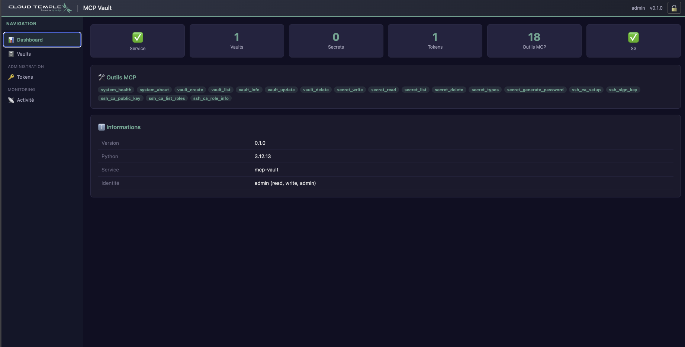
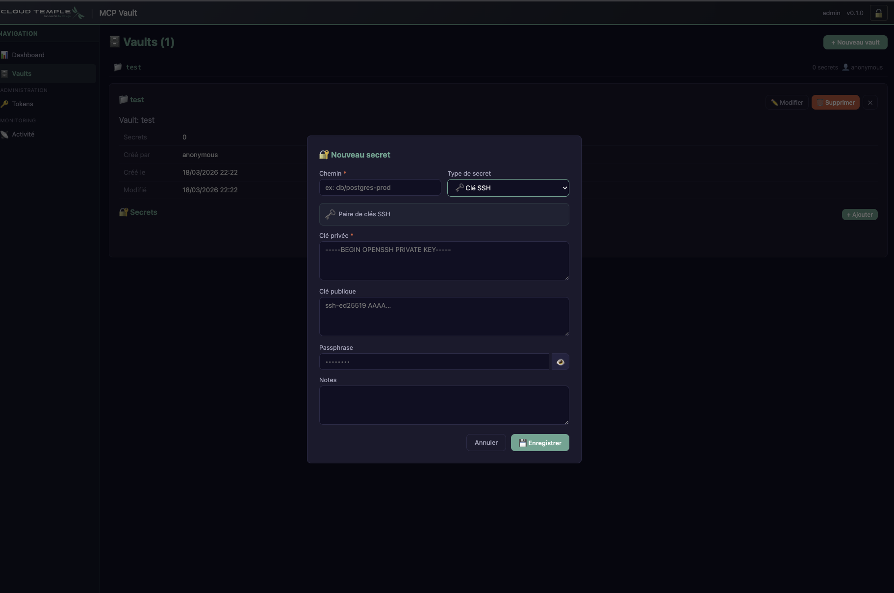
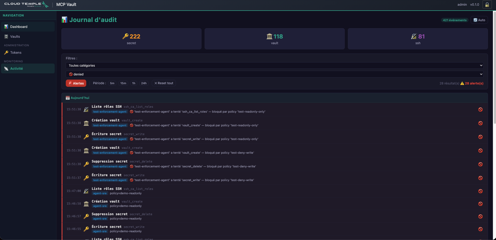

# 🔐 MCP Vault

> **Secure secret management for AI agents — embedded OpenBao**

> 🇫🇷 [Version française](README.md)

MCP Vault is an [MCP](https://modelcontextprotocol.io/) server that provides a secret vault for AI agents and missions. It embeds [OpenBao](https://openbao.org/) (open-source fork of HashiCorp Vault, Linux Foundation) as its encryption engine.

**Think 1Password, but for your AI agents.**

### 📸 Admin console

|               Dashboard                |          Vaults & Secrets           |          Audit & Alerts            |
| :------------------------------------: | :---------------------------------: | :--------------------------------: |
|  |  |  |

---

## 📖 Documentation

| Document                                                | Description                                                                                                                                                                  |
| ------------------------------------------------------- | ---------------------------------------------------------------------------------------------------------------------------------------------------------------------------- |
| [**ARCHITECTURE.md**](DESIGN/mcp-vault/ARCHITECTURE.md) | Full specification — vision, 6-layer ASGI architecture, vaults, SSH CA, MCP policies (6 ready-to-use examples), unseal key security (3 factors), HSM roadmap                  |
| [**TECHNICAL.md**](DESIGN/mcp-vault/TECHNICAL.md)       | Technical documentation — source modules (incl. PKI v0.5.1), 6-layer ASGI stack, Docker, tests, dependencies, roadmap                                                         |
| [**SECURITY_AUDIT.md**](DESIGN/mcp-vault/SECURITY_AUDIT.md) | Consolidated security audit report — 60 V2.1 findings, 28 fixed, 13 residual documented                                                                                   |
| [**scripts/README.md**](scripts/README.md)              | Full CLI guide — command groups, examples, day-to-day ergonomics                                                                                                               |
| [**tests/README.md**](tests/README.md)                  | Test execution guide — 4 levels, ~600 tests, commands for auditors                                                                                                           |
| [**TEST_CATALOG.md**](tests/TEST_CATALOG.md)            | e2e test catalog — 15 categories, 349 assertions, purpose of each section (for auditors)                                                                                     |

---

## ⚡ Quick start

```bash
# 1. Clone and configure
cp .env.example .env
# Adjust S3 credentials in .env

# 2. Build and start
docker compose build
docker compose up -d

# 3. Check (from the container)
docker compose exec mcp-vault python scripts/mcp_cli.py health

# 4. Test (349 e2e tests)
docker compose exec mcp-vault python tests/test_e2e.py
```

### Automatic lifecycle

On startup, MCP Vault:
1. Loads tokens from S3
2. Restores OpenBao data (Docker volume first; otherwise S3 — an ambiguous S3 failure, e.g. network, refuses startup rather than initializing an empty vault over a possibly-valid remote backup)
3. Starts OpenBao, initializes it (first time) and unseals it
4. **Unseal keys**: encrypted (AES-256-GCM) on S3, never in cleartext on disk — only in memory
5. Enables periodic S3 sync (60s, **conditional**: a PUT only happens if the state changed since the last successful upload — see `s3_sync.py`)

On shutdown (`docker compose stop`):
1. Seals OpenBao 🔒
2. Final upload to S3 📤
3. Stops the process — keys wiped from memory

---

## 🛠️ MCP tools (39)

### System (2)

| Tool            | Description                                       |
| --------------- | ------------------------------------------------- |
| `system_health` | Health status (OpenBao + S3)                      |
| `system_about`  | Service info (version, tools, platform)           |

> 💡 **Introspection**: the `/admin/api/whoami` endpoint and the `whoami` CLI command let you check the identity and permissions of the current token.

### Vaults — secret stores (5)

| Tool                                   | Perm  | Description                                            |
| -------------------------------------- | ----- | ------------------------------------------------------ |
| `vault_create(vault_id, description?)` | write | Creates a vault (KV v2 mount) + metadata (owner, date) |
| `vault_list()`                         | read  | Lists accessible vaults (filtered by token)            |
| `vault_info(vault_id)`                 | read  | Vault details (metadata, secrets_count, owner)         |
| `vault_update(vault_id, description)`  | write | Updates a vault's description                           |
| `vault_delete(vault_id, confirm)`      | admin | Deletes a vault and all its secrets ⚠️                |

### Secrets (6)

| Tool                                        | Perm  | Description                                   |
| ------------------------------------------- | ----- | --------------------------------------------- |
| `secret_write(vault_id, path, data, type?)` | write | Writes a typed secret                         |
| `secret_read(vault_id, path, version?)`     | read  | Reads a secret (latest version or specific)   |
| `secret_list(vault_id, path?)`              | read  | Lists a vault's keys                          |
| `secret_delete(vault_id, path)`             | write | Deletes a secret and all its versions         |
| `secret_types()`                            | read  | Lists the 14 secret types                     |
| `secret_generate_password(length?, ...)`    | read  | Generates a CSPRNG password                   |

### SSH Certificate Authority (5)

Each vault has its **own isolated SSH CA** — CAs are cryptographically distinct between vaults. A certificate signed by one vault's CA does NOT work on servers configured for another vault.

| Tool                                                 | Perm  | Description                                                |
| ---------------------------------------------------- | ----- | ---------------------------------------------------------- |
| `ssh_ca_setup(vault_id, role, allowed_users?, ttl?)` | write | Configures an SSH CA + role in a vault                     |
| `ssh_sign_key(vault_id, role, public_key, ttl?)`     | read  | Signs a public key → ephemeral certificate                 |
| `ssh_ca_public_key(vault_id)`                        | read  | CA public key (for `TrustedUserCAKeys` on servers)        |
| `ssh_ca_list_roles(vault_id)`                        | read  | Lists SSH CA roles configured in a vault                  |
| `ssh_ca_role_info(vault_id, role)`                   | read  | Role details (TTL, allowed_users, extensions)             |

### Operator SSH JIT access (2) *(v0.9.0)*

| Tool | Perm | Description |
| --- | --- | --- |
| `ssh_operator_access_profiles()` | read | Lists closed profiles available to the current named bearer |
| `ssh_request_operator_access(profile_id, public_key, reason)` | write | Issues a short certificate bound to a pre-enrolled public key |

The caller never selects the CA vault, OpenBao role, principal, target or TTL.
The operator's identity relies on a named bearer token scoped by a dedicated
policy (the same mechanism as the rest of the system), plus a standard SSH
public key (`ssh-ed25519`/`ecdsa-sha2-nistp256`) pre-enrolled by fingerprint.
This exceptional human path remains separate from the external break-glass
path and from autonomous agents.
Profiles may be supplied through `SSH_OPERATOR_PROFILES_JSON` or, for strict
`.env` renderers, its URL-safe Base64 equivalent
`SSH_OPERATOR_PROFILES_B64`; both sources are mutually exclusive.

### MCP Policies — granular access control (4)

Policies restrict the tools accessible per token, with support for **wildcards** (`system_*`, `ssh_*`...) and **per-vault rules** (`prod-*` → read-only).

| Tool                                                                                 | Perm  | Description                                         |
| ------------------------------------------------------------------------------------ | ----- | --------------------------------------------------- |
| `policy_create(policy_id, description?, allowed_tools?, denied_tools?, path_rules?)` | admin | Creates a policy with access rules                  |
| `policy_list()`                                                                      | admin | Lists policies with counters                        |
| `policy_get(policy_id)`                                                              | admin | Full details (allowed/denied tools, path_rules)     |
| `policy_delete(policy_id, confirm)`                                                  | admin | Deletes a policy ⚠️                                |

> 📋 6 ready-to-use policies documented in [ARCHITECTURE.md §6.4.1](DESIGN/mcp-vault/ARCHITECTURE.md): `readonly`, `operator-ssh-jit`, `developer`, `prod-reader-dev-writer`, `ci-cd-agent`, `security-auditor`
>
> 🔒 **Fail-close on S3 outage** *(v0.8.3, #86)*: once the cache expires (5 min), a
> detected S3 outage or corruption now causes policy decisions to be explicitly
> refused, instead of silently continuing to serve stale rules.

### Token Management (1)

| Tool                                                           | Perm  | Description                                             |
| -------------------------------------------------------------- | ----- | ------------------------------------------------------- |
| `token_update(hash_prefix, policy_id?, permissions?, vaults?)` | admin | Modifies an existing token (policy, permissions, vaults) |

> **Revoked-token purge** *(v0.7.0 — **admin** operation, exposed via REST / CLI / SPA; this is NOT an MCP tool)*: permanently deletes tokens revoked more than N days ago (retention, default 30). **Fail-close** (never an active token nor an expired-but-not-revoked one), **dry-run + confirmation**, rollback if S3 is unavailable, every purge **audited**. Via `POST /admin/api/tokens/purge`, the CLI command `token purge-revoked`, or the « 🧹 Purge revoked » button in the `/admin` console.
>
> 🔒 **Strict validation** *(v0.8.3, #86)*: `permissions`/`allowed_resources` are now
> strictly validated on create, update and load — never permissive by default on a
> malformed value (fixes a possible privilege escalation via a wrong-typed value).

### Internal PKI — CA + ACME (8) *(v0.5.0)*

Sovereign CA for the ecosystem: Caddy WAFs enroll via ACME exactly like with Let's Encrypt, but on an internal CA isolated from the public network. Usable in lab (`*.lesur.lan`) and in air-gapped production.

| Tool | Perm | Description |
| --- | --- | --- |
| `pki_ca_setup(lab_mode, allowed_domains, leaf_ttl)` | admin | Initializes root + intermediate CA + ACME role |
| `pki_ca_public_key()` | read | Root CA PEM, SHA-256 fingerprint, stable URL |
| `pki_ca_list_roles()` | read | Lists issuance roles |
| `pki_ca_role_info(role_name)` | read | Role details (domains, TTL, TLS flags) |
| `pki_list_certs(limit?, offset?)` | admin | Paginated inventory of issued certificates |
| `pki_issue_cert(common_name, ttl?, alt_names?, ip_sans?)` | admin | Manual certificate issuance (off-ACME) — one-shot private key |
| `pki_revoke_cert(serial_number)` | admin | Revocation + CRL update |
| `pki_ca_rotate_intermediate(keep_old_issuer?, overlap_ttl?)` | admin | Intermediate CA rotation without downtime |

> Public endpoints (no-auth, standard ACME/PKI): `/acme/directory`, `/pki/ca/root.pem`, `/pki/ca/chain.pem`, `/pki/ca/crl.pem`
>
> **`PKI_BASE_URL`** (optional): base URL for CDPs and the OpenBao ACME cluster path. Empty = derived from `MCP_ALLOWED_HOSTS`. Docker test override: `http://mcp-vault:8030`. Must be `http(s)://`.

### JIT Wrap Broker + mediated consumption — C18 (5) *(v0.4.13 / v0.6.x)*

Contract for the mcp-mission `CredentialBrokerService`: single-use credential delivery via OpenBao response wrapping (cubbyhole), with a write-ahead registry on S3 for orphan compensation, and anti-confused-deputy validation (C18).

| Tool | Perm | Description |
| --- | --- | --- |
| `secret_wrap(vault_id, secret_path, mission_id, operation_id, ttl_seconds?, tenant_id?, expected_aud?)` | wrap | Creates a single-use wrap token (write-ahead registry). ⚠️ **`tenant_id` is MANDATORY when `ENFORCE_MISSION_TOKEN_VALIDATION=true`** — the server cannot infer it, and a provision with an incomplete binding would be rejected at consumption time *(#78)*. A missing (or blank) `expected_aud` is filled in from configuration; an audience naming a **different** instance is rejected (`binding_mismatch`) because the wrap would be unconsumable; inconsistent enforced configuration (empty JWKS, unresolvable audience) → `misconfigured` |
| `secret_revoke_wrap(lease_id)` | wrap | Idempotent revocation, scoped to the caller; uninitialized registry → `error/registry_unavailable` *(#120)*. ⚠️ An accessor not found **in an available registry** returns `ok/not_found`: that is a **successful call**, not a revocation — no OpenBao call was attempted (see the re-creation table below) |
| `secret_wrap_lookup(operation_id, mission_id)` | wrap | Finds & **revokes** the pair's wraps (orphan compensation #74). ⚠️ `mission_id` REQUIRED: an operation_id is not unique across missions, and without it compensating one mission's orphan revoked another mission's live provision |
| `secret_wrap_status(operation_id, mission_id)` | wrap | Reads a wrap's state **without revoking it** — read-only, best-effort snapshot (#77). ⚠️ `mission_id` REQUIRED: without it, another mission's provision state was disclosed |
| `secret_consume(wrap_token, operation_id, mission_token)` | admin | Validates ES256/JWKS JWT (full PEP contract since *(#86)*: exp/iat/iss/aud/mission_id/jti/scope/tenant_id + `component_id`), checks full binding (mission_id, tenant_id, aud) — in enforced mode BOTH fields are required *(#78)*, unwraps OpenBao (C18). Non-retryable error contract: `wrap_unusable`, `consume_outcome_unknown`, `empty_secret` *(#78)* |

> *(#115)* Permission `wrap` (or `admin`): a non-admin `wrap` token must carry a non-empty `allowed_resources` list **and** an explicit policy (named `allowed_tools`, a matching `path_rule` with non-empty `allowed_paths` — strict evaluation). A wrap-only token (no read/write/admin) is confined to these 4 tools (MCP) and denied on all `/admin/api/*`. Revoke/lookup/status are scoped to the caller's vaults+paths. ⚠️ Downgrade ≤ 0.9.2: revoke/purge `wrap` tokens first (otherwise the whole `tokens.json` is rejected, see CHANGELOG).
> Enable C18 validation with `ENFORCE_MISSION_TOKEN_VALIDATION=true`. Default (false): log warning, continue — zero impact in standalone mode without mcp-mission.
> `tenant_id` and `expected_aud` in `secret_wrap` feed the full C18 binding on the `secret_consume` side *(v0.6.8)*.
> ⚠️ *(#86)* As soon as `ENFORCE_MISSION_TOKEN_VALIDATION=true` (standalone, or via the `/mcp` PEP below), `MISSION_JWKS_URL`, `MCP_INSTANCE_ID`/`MISSION_TOKEN_AUD` **and** `MISSION_STATUS_URL` become mandatory (fail-fast at boot) — otherwise an aborted mission would keep access until the `mission_token` expires.
> ⚠️ *(#86)* The validator now applies EXACTLY the same contract as the `/mcp` PEP below (same required claims, same `component_id` check) — a genuine JWT meant for another vault instance is now rejected by both enforcement points, not just the first one.

#### External-effect matrix — what an error code lets you DEDUCE *(v0.14.0)*

**Every business error code arrives as an ENVELOPE, `isError = false`.** A caller
that only looks at `isError` reads them all as successes. **Read `status`, then
`error_type`** — in that order, because some refusals still carry no code (see the
closing note).

`isError = true` signals only two things: a **schema violation** (required
parameter missing **or** of the wrong type — the tool body never ran, so no write,
no OpenBao call, no revocation), or an unexpected defect. A parameter that is
schema-valid but **semantically refused** comes back as an envelope.

**`secret_wrap`** — the code name is not enough: a resource may exist.

| Code | OpenBao call | Resource to compensate |
| --- | --- | --- |
| `invalid_input`, `backend_unavailable`, `operation_pending` | **none** | no, for this call |
| `operation_failed` *(v0.13.0)* | **none** for this call | ⚠️ **possibly, from an EARLIER attempt** — without an accessor, hence not compensable |
| `operation_revocable` *(v0.13.0)* | **none** for this call | ⚠️ **possibly, from an EARLIER provision** — but it carries an accessor, so it **is** compensable |
| `operation_terminated` *(v0.14.0)* | **none** for this call | no — earlier provision held as finished, nothing to compensate |
| `registry_inconsistent` *(v0.14.0)* | **none** for this call | ⚠️ **unknown** — unreadable entry, nothing can be inferred |
| `registry_unavailable` | **none** | no |
| `wrap_created_revoked` | **wrap created** | no — revocation confirmed |
| `wrap_created_orphaned` | **wrap created** | ⚠️ **possibly** — may live until TTL, **not compensable** |
| `not_found`, `backend_error` | **issued** | ⚠️ **unknown** — do not replay the same key |

⚠️ `backend_error` may follow a call OpenBao actually received (timeout, network
cut); `not_found` is derived from a pattern searched in the exception text, hence
unproven. In both cases the intent is marked `failed` **without an accessor**.

**The key is then BLOCKED PERMANENTLY** — a replay returns `operation_failed`,
with no OpenBao call at all. *(Up to v0.12.1 it became replayable again, and the
replay created a second wrap while the first one could still be alive.)* If
persisting that marking fails, the entry reverts to `pending` and the key is
blocked under `operation_pending`: same block, different code. **Recovery = a new
`operation_id`, in every case.**

> ⚠️ **v0.14.0 — A KEY IS SINGLE-USE, UNCONDITIONALLY.** Any entry at all for the
> `(operation_id, mission_id)` pair blocks `secret_wrap`, whatever its state,
> **including a corrupted entry**: an unreadable entry is a reason to refuse,
> never to allow. **Nothing releases a key any more.**
>
> In v0.13.0, `revoked`, `consumed` and `unusable` reopened it — to preserve the
> broker's "revoke then re-create" recovery. That recovery was dropped from its
> design, and the production census of `wrap` token holders found only one.
> That release was also the last path by which a **foreign** token presented to
> `secret_consume` could mark an entry `unusable` — and release a key whose real
> wrap was still alive.
>
> ⚠️ **The guard covers CREATION only.** `secret_revoke_wrap`,
> `secret_wrap_status` and `secret_wrap_lookup` stay open on an engaged key:
> without that the caller would be locked in with resources it could neither see
> nor cut. A test counts the guard's callers and fails if a second one appears.
>
> ⚠️ **Two bypasses are NOT closed**: loss of the registry file (empty registry =
> every key becomes pristine again) and the race between two instances, absent
> CAS/ETag *(#51)*. These are not business releases, but uniqueness is not
> absolute either.
>
> ⚠️ **That first bypass was wider than this sentence admitted, up to and
> including v0.15.0** *(#149, fixed in v0.16.0)*. Losing the file was not
> required: **a misread storage error was enough.** The registry concluded "object
> absent" as soon as the error text *contained* "404" — a request id, a port, a
> 404 emitted by an intermediary — then started empty **while declaring itself
> trustworthy**, so the fail-close refusal never fired and the probe reported
> nothing. **A second door reached the same effect with no error at all**: a read
> that succeeded while returning valid JSON without the `wraps` key (a `{}`, a
> truncated body) was taken for an empty registry. From now on, only an absence
> authenticated by the structured error field (`NoSuchKey`) empties the registry,
> and the document is validated before any state mutation; everything else
> refuses creation. This is the rule the three authorization stores have applied
> since #69.

> A `failed` (or `pending`) intent without an accessor returns `found_unattached` on `secret_wrap_lookup`: no revocation is possible, only the TTL bounds the possible resource. ⚠️ That verdict does **not** state that a resource exists — it states that we cannot rule it out. *(v0.12.1: this case used to answer `already_revoked`, asserting a revocation that never happened.)*

**The other four tools**, on the unavailability codes:

| Tool | External effect | Conduct |
| --- | --- | --- |
| `secret_revoke_wrap` — `ok` + `registry_persisted: false` *(v0.14.1)* | **revocation DONE**, but not recorded in the registry | replay the compensation later — see the box below |
| `secret_revoke_wrap` — `registry_unavailable`, `backend_unavailable` | **none**, no revocation attempted | retry safe **and required** |
| `secret_revoke_wrap` — `backend_error` | call **issued**, effect **unknown** | retry safe (revocation is idempotent) |
| `secret_wrap_lookup` — `backend_unavailable` | **none**: both fail-close guards precede any revocation | wait then retry, safe |
| `secret_wrap_lookup` — `partial_revocation` | **unknown** for uncounted entries (`count_revoked` states what landed) | retry safe, but it will not resolve frozen entries |
| `secret_wrap_status` — `backend_unavailable` | **none**: registry absent or last S3 refresh failed | retry always safe |

> ⚠️ **A CONFIRMED EFFECT MAY NOT SURVIVE A RESTART** *(structural limit, #140 —
> **settled**, see #123)*. When a revocation succeeds at the vault but the
> registry write fails, the fact is recorded **nowhere durable**: on restart the
> entry **may reappear not revoked**, in a state we have just reported as revoked
> to the caller.
>
> *"May", not "will"*: an S3 exception does not prove the write did not land — a
> timeout can follow an already-accepted write — and the registry is
> **last-write-wins with no lock**, so another instance may have written in the
> meantime. The caller therefore cannot infer the durable state from the failure;
> it can only treat it as **undetermined**.
>
> **This is not fixable with a single durable store** — recording the fact would
> require a store available at the very moment the usual one is not. Holding the
> guarantee would take a **second store**: a local journal, replayed in
> reconciliation **before** the registry is served again. The local volume
> already exists in the deployment; the mechanism does not — and it would be
> **instance-local**, invisible to another instance and lost with the host.
>
> ⚠️ **DECISION (#123): that second store will not be built.** The limit is
> **accepted and published**, it is not pending a fix.
> **Do not size your contract on the assumption that it will go away.**
>
> What we do instead, since **v0.14.1**: we do not make the fact durable, but we
> **say so** — the response then carries `registry_persisted: false` and a
> `warning`. The field is **absent** on the nominal path.
>
> ⚠️ **The signal has the SAME shape on BOTH revocation verbs** —
> `secret_revoke_wrap` and `secret_wrap_lookup`: `registry_persisted: false`,
> `count_not_persisted` (the number of entries actually mutated and not
> recorded) and a `warning`. On the compensation verb it is **also carried by
> the `partial_revocation` and `consume_terminal` exits** — the caller is
> already handling an incident there, the worst moment to hide an unrecorded
> revocation.
>
> ⇒ **Conduct**: treat any answer carrying `registry_persisted: false` as a
> revocation that is **real but unrecorded** — do not close your own registry on
> it, and run the compensation again later. The same limit affects
> `secret_wrap`'s emergency revocation, where the entry stays `pending` and
> `secret_wrap_lookup` will answer `found_unattached` for a resource we **treat
> as** dead — the server takes an exception-free OpenBao return as a confirmed
> revocation, it reads nothing back to attest it.

> `secret_wrap_status` mutates neither OpenBao nor the registry (the memory cache and audit log do change). It does **not** distinguish transient from durable failure: best-effort snapshot. ⚠️ *Fixed in v0.15.0* — an S3 outage during the cache window used to go **entirely undetected**; the background refresher now observes it on its next attempt (half-TTL, then every 10 s), and `status` flips to `backend_unavailable`. Detection is not instantaneous, but it happens.

#### What the registry PROVES — and what it does not

🔴 **`secret_wrap_status` returns what the REGISTRY BELIEVES, not an OpenBao
finding.** No OpenBao client is called. Every answer is a **dated belief**:

- **`active` does not prove a wrap is alive** — it may have expired, been consumed
  or revoked at OpenBao without any registry transition being written.
- **`consuming` does not attest that an unwrap was issued**: the state is
  persisted **before** the unwrap call.
- **`consumed`, `revoked`, `unusable` speak of ONE entry only**, never of the
  pair: several entries can coexist for the same `(operation_id, mission_id)` —
  historically, because the key lock only looked at `pending` up to v0.12.1.
  ⚠️ A terminal state on one says **nothing** about the others: an `unusable`
  entry can coexist with an `active` one.
- **`revoked`** is also set when OpenBao answers 400/404: that is idempotence, not
  proof of the token's fate.

⚠️ **`ambiguous` from `secret_wrap_status` and `ambiguous` from
`secret_wrap_lookup` are not the same word.** Status is **pure**; lookup is
**destructive** — faced with several entries it revokes the active ones. **Never
call `secret_wrap_lookup` to understand an `ambiguous`**: it would destroy what
you are trying to diagnose. No verb details an `ambiguous` (neither cardinality
nor individual state): it is a terminal refusal, with no investigation.

**When may you re-create after `secret_revoke_wrap`?**

| Answer | Re-create? |
| --- | --- |
| `ok/revoked`, `ok/already_revoked` | ✅ revocation issued and accepted, or token declared invalid/absent by OpenBao |
| `ok/not_found` | ❌ **no OpenBao call attempted** — accessor unknown to the registry or out of scope |
| `backend_error`, `backend_unavailable`, `registry_unavailable` | ❌ nothing attested |

**`secret_consume`** — "no call issued" does **not** mean "token intact": on these
paths we never look at the token, which may have expired or been consumed
concurrently.

| Code | Did this invocation present the wrap? | Token state |
| --- | --- | --- |
| `invalid_input`, `misconfigured`, `jwt_invalid`, `mission_inactive` | no | **not observed** |
| `registry_unavailable`, `backend_unavailable` | no | **not observed** |
| `permission_denied` *(v0.12.1 — replaces an envelope with no code)* | no | **not observed** |
| `binding_mismatch`, `not_found`, `already_consuming` | no | **not observed** |
| `binding_incomplete` | no | unconsumable in enforced mode → **reprovision** |
| `already_consumed` | no | spent or revoked |
| `wrap_unusable` | depends on the path | **dead** |
| `consume_outcome_unknown` | **possible** | treat as **lost** |
| `empty_secret` | **yes** | **burned** |

⚠️ Where the state is **"not observed"**, destroying the access of your own accord
is a pure loss. But a fresh attempt **is not a probe**: if the cause of the refusal
is lifted, it **may consume** the wrap.
⚠️ `backend_error` is **not reachable** on `secret_consume` (any unwrap exception
lands on `wrap_unusable` or `consume_outcome_unknown`), and `wrap_expired` **does
not exist** — it wrongly appeared in an earlier version of this contract.
⚠️ `already_consumed` covers `consumed` **and** `revoked`; `secret_wrap_status`
disambiguates only when there is **exactly one** entry, otherwise it returns
`ambiguous`.

> **Refusals without `error_type`** — the closed taxonomy (`unauthenticated`,
> `permission_denied`, `access_denied`, `invalid_input`, `invalid_token`,
> `policy_store_unavailable`) covers the shared authorization guards. Tool-specific
> **validation** refusals outside the wrapping scope (`secret_list`, `/admin/api`
> surfaces) still return an envelope with no code. **Test `status` before
> `error_type`.**

### Mission JWT PEP — `/mcp` front door *(v0.8.0, #47 + #69)*

Second enforcement point (PEP) for the mcp-mission `mission_token` (ES256 JWT), **at the `/mcp` front door** (the first one being `secret_consume`/C18, at consumption). Driven by `MCP_AUTH_MODE`:

| Mode | `/mcp` behaviour |
| --- | --- |
| `bearer` *(default)* | Opaque bearer **required**: a request with no token, or an invalid one, gets `401` at the middleware (#116). |
| `bearer-anonymous` | ⚠️ **Exception mode** — former `bearer` behaviour: an unauthenticated caller reaches the tools. Temporary fallback only; `CRITICAL` at startup. |
| `jwt` | `mission_token` JWT ES256 **required** (opaque bearer rejected). Also requires `ENFORCE_MISSION_TOKEN_VALIDATION=true` and `MISSION_STATUS_URL` (fail-fast, #86). |
| `dual-stack` | Valid JWT **or** valid opaque bearer (migration). Same requirements as `jwt` above. |

In `jwt`/`dual-stack`, the middleware **actively rejects**: `401` (missing/opaque/invalid JWT), `403` (`aud`/`component_id` ≠ instance, inactive mission), `503` (JWKS unavailable — fail-close). An invalid JWT **never** falls back to the bearer path. The token is checked against the real mcp-mission contract (`aud` contains `MCP_INSTANCE_ID`, `component_id[MCP_COMPONENT_KIND] == MCP_INSTANCE_ID`, `iss`, `exp` leeway 0, `iat` anti-skew). The admin bootstrap key remains accepted (break-glass).

> A valid mission identity is **authenticated and instance-bound**, then mcp-vault (**local PDP**) resolves a **locally-provisioned vault scope** for it. Without a grant, **no access** (deny-by-default); infra tools (`system_*`, PKI inventory) and the admin plane (`vault_create/delete`, `ssh_*`) are denied to it. The admin endpoint `POST /admin/api/auth/jwks/reload` forces a JWKS reload (urgent `kid` revocation).

#### Vault-scope grant — `MissionBindingStore` *(#69)*

The `mission_token` carries **no** vault authorization: the grant is **provisioned locally**, keyed by `tenant_id` (stable claim), and stored one **file per instance** on S3.

- A grant ("binding") = `{tenant_id, allowed_resources:[vaults…], permissions, policy_id?, enabled, expires_at?}`.
- **Strict permissions**: `read` or `read,write` (never `write` alone, never `admin`). **Data-plane only**: read/write secrets in the allowed vaults — **never** create/destroy a vault nor manage an SSH CA.
- **Fail-close**: missing/disabled/expired binding → no access. **Store unavailable/corrupt → `503`** (observable denial, never a silent deny nor a destructive overwrite).
- **Administration** (bearer/bootstrap admin only — never via mission JWT):

```bash
mcp-cli mission-binding create acme-corp --vaults prod-app --permissions read
mcp-cli mission-binding create acme-corp --vaults prod-app,staging --permissions read,write
mcp-cli mission-binding list
mcp-cli mission-binding get acme-corp
mcp-cli mission-binding delete acme-corp
mcp-cli mission-binding purge --older-than 30 --dry-run   # expired bindings
```

> **Tenant granularity**: all active missions of the same client (`tenant_id`) share the granted scope. Per-mission granularity already exists at consumption time (`secret_consume`/C18).

### Audit (1)

| Tool                                                                       | Perm  | Description                                                              |
| -------------------------------------------------------------------------- | ----- | ----------------------------------------------------------------------- |
| `audit_log(limit?, client?, vault_id?, tool?, category?, status?, since?)` | admin | Filterable audit log (5000-entry ring buffer + persistent JSONL)        |

> **Access lifecycle audit trail** *(v0.7.0 — SecNumCloud/HDS compliance)*: every mutation of the access-control plane — token create / update / revoke / purge, policy create / delete — is logged, via the **admin REST API** as well as the **MCP tools**. Persistence failures of **removal** operations (revocation, purge, policy deletion — those that leave an access active if they fail) are also traced. The trace lives in `audit-mcp.jsonl`, **physically independent of `_system/tokens.json`** → it survives a purge. The raw token never appears in audit detail.

<details>
<summary>💡 Typical SSH CA workflow (e.g. LLMaaS infrastructure)</summary>

```python
# 1. Initial setup (ONE-TIME) — create vault + SSH roles
vault_create("llmaas-infra", description="SSH CA LLMaaS")
ssh_ca_setup("llmaas-infra", "adminct", allowed_users="adminct", ttl="1h")
ssh_ca_setup("llmaas-infra", "agentic", allowed_users="agentic,iaagentic", ttl="30m")

# 2. Deploy the CA on servers (ONE-TIME)
result = ssh_ca_public_key("llmaas-infra")
# → Put result["public_key"] in /etc/ssh/trusted-user-ca-keys.pem

# 3. Daily usage — sign a public key
cert = ssh_sign_key("llmaas-infra", "adminct", public_key="ssh-ed25519 AAAA...", ttl="1h")
# → cert["signed_key"] = signed certificate, valid 1h
# → OpenSSH uses it automatically when placed next to the private key
```

</details>

---

## 🔑 Secret types (1Password-style)

| Type            | Icon  | Required fields          | Usage                |
| --------------- | ----- | ------------------------ | -------------------- |
| `login`         | 🔑   | username, password       | Web/app credentials  |
| `password`      | 🔒   | password                 | Simple password      |
| `secure_note`   | 📝   | content                  | Secure notes         |
| `api_key`       | 🔌   | key                      | API keys             |
| `ssh_key`       | 🗝️ | private_key              | SSH key pairs        |
| `database`      | 🗄️ | host, username, password | DB connections       |
| `server`        | 🖥️ | host, username           | Server access        |
| `certificate`   | 📜   | certificate, private_key | TLS/SSL certificates |
| `env_file`      | 📄   | content                  | .env files           |
| `credit_card`   | 💳   | number, expiry, cvv      | Bank cards           |
| `identity`      | 👤   | name                     | Identities           |
| `wifi`          | 📶   | ssid, password           | Wi-Fi networks       |
| `crypto_wallet` | ₿     | *(all optional)*         | Crypto wallets       |
| `custom`        | ⚙️  | *(free fields)*          | Everything else      |

Each secret supports: `tags`, `favorite`, automatic KV v2 versioning.

---

## 🔒 Authentication

> ⚠️ **Only the `Authorization: Bearer <token>` header is accepted.** Query-string authentication (`?token=`) was removed for security reasons (v0.3.1).

```
Authorization: Bearer <token>
```

| Permission | Read | Write | Admin |
| ---------- | ---- | ----- | ----- |
| `read`     | ✅   | ❌    | ❌    |
| `write`    | ✅   | ✅    | ❌    |
| `admin`    | ✅   | ✅    | ✅    |

**3 isolation layers**:
1. **Vault-level**: `allowed_resources=[]` → owner-based (only vaults created by the token), or explicit list
2. **Tool-level**: policies with `allowed_tools`/`denied_tools` (fnmatch wildcards)
3. **Path-level**: `allowed_paths` in `path_rules` → control per individual secret

---

## 🖥️ CLI

MCP Vault includes a full CLI with Click + Rich:

```bash
# Scriptable commands
python scripts/mcp_cli.py health
python scripts/mcp_cli.py about
python scripts/mcp_cli.py whoami                       # Current token identity
python scripts/mcp_cli.py vault list
python scripts/mcp_cli.py vault create prod-servers -d "Prod SSH keys"
python scripts/mcp_cli.py secret write prod-servers web/github -d '{"username":"me","password":"s3cr3t"}' -t login
python scripts/mcp_cli.py secret read prod-servers web/github
python scripts/mcp_cli.py secret password -l 32
python scripts/mcp_cli.py token create agent-sre --vaults prod --policy readonly
python scripts/mcp_cli.py token list
python scripts/mcp_cli.py token purge-revoked --older-than 30 --dry-run    # preview (nothing deleted)
python scripts/mcp_cli.py token purge-revoked --older-than 30 --yes        # effective purge
python scripts/mcp_cli.py policy create no-ssh -d "No SSH" --denied "ssh_*"
python scripts/mcp_cli.py policy create team-x --allowed "secret_*" --path-rules '[{"vault_pattern":"shared-*","allowed_paths":["shared/*"]}]'
python scripts/mcp_cli.py audit --status denied --limit 10

# Operator SSH JIT
python scripts/mcp_cli.py ssh profiles
python scripts/mcp_cli.py ssh request bastion-prod \
  --key ~/.ssh/id_ed25519.pub --reason "INC-230 bastion maintenance"

# Internal PKI (v0.5.0)
python scripts/mcp_cli.py pki setup --lab --domains '*.lesur.lan,lesur.lan'
python scripts/mcp_cli.py pki ca-key
python scripts/mcp_cli.py pki certs
python scripts/mcp_cli.py pki revoke 12:34:ab:cd:ef:12:34:56
```

> The **interactive shell was removed** in v0.11.0 (issue #128): its hand-rolled
> argument parser silently ignored unrecognised options, so a typo ran a
> *different* operation from the one typed. Click rejects those inputs. See
> [scripts/README.md](scripts/README.md) for how to keep an interactive-feeling
> session.

> The `--help` of each command explains the 3-layer security model and guides the user.

See [scripts/README.md](scripts/README.md) for the full CLI documentation.

---

## ⚙️ Environment variables

Copy `.env.example` → `.env` and adjust. **`.env.example` is the authoritative
configuration contract**: it declares exactly the **45** variables consumed by
`Settings` ([`src/mcp_vault/config.py`](src/mcp_vault/config.py)), no more and no
fewer, and it is enforced by
[`tests/test_env_example_contract.py`](tests/test_env_example_contract.py).

> ⚠️ **`extra="forbid"`**: a key that is absent from this contract and carries a
> non-empty value in your `.env` **makes startup fail**. Never assemble a `.env`
> from any source other than `.env.example`.
>
> **`REQUIRED` marker**: a variable whose example value is `REQUIRED` has **no
> usable default**. The marker deliberately fails validation — the service
> refuses to start until a deployment substitutes a real value.

| Group | Variables | Required |
|--------|-----------|----------|
| **Server** | `MCP_SERVER_NAME`, `MCP_SERVER_HOST`, `MCP_SERVER_PORT`, `MCP_SERVER_DEBUG`, `MCP_ALLOWED_HOSTS`, `MCP_ALLOWED_ORIGINS` | No — all have defaults. But behind a reverse proxy, `MCP_ALLOWED_HOSTS` must list the public FQDNs, otherwise the SDK rejects the `Host` header with HTTP 421 (issue #3) |
| **WAF** | `WAF_PORT` | No — defaults to `8085` |
| **Auth** | `ADMIN_BOOTSTRAP_KEY` | **Yes — the only variable with no usable default.** Encrypts the unseal keys and acts as the fallback admin credential. Minimum 32 characters, ≥ 3 character classes; startup is refused otherwise |
| **Operator SSH JIT** *(v0.9.0)* | `SSH_OPERATOR_PROFILES_JSON` or `SSH_OPERATOR_PROFILES_B64`, plus the 7 `SSH_OPERATOR_JIT_*` bounds | No — empty disables it; the profile contains no secret |
| **S3** | `S3_ENDPOINT_URL`, `S3_ACCESS_KEY_ID`, `S3_SECRET_ACCESS_KEY`, `S3_BUCKET_NAME`, `S3_REGION_NAME` | **Yes for a functional deployment.** The process starts without S3, but in **degraded mode**: stores stay in memory (tokens lost on every restart) and, on a fresh volume, the restore attempt fails *ambiguously*, which prevents OpenBao from starting (deliberate fail-close, see `lifecycle.py`) |
| **Storage sync** | `VAULT_S3_PREFIX`, `VAULT_S3_SYNC_INTERVAL` | No |
| **OpenBao** | `OPENBAO_ADDR`, `OPENBAO_SHARES`, `OPENBAO_THRESHOLD`, `OPENBAO_DATA_DIR`, `OPENBAO_CONFIG_DIR` | No |
| **PKI** *(v0.5.x)* | `PKI_BASE_URL` | No — empty derives it from the first FQDN; overrides the ACME URL in Docker tests |
| **Mission JWT** *(v0.6.x)* | `ENFORCE_MISSION_TOKEN_VALIDATION`, `MISSION_JWKS_URL`, `MISSION_TOKEN_AUD`, `MISSION_JWKS_CACHE_TTL`, `MISSION_JWKS_MAX_REFRESH_PER_MIN`, `MISSION_TOKEN_LEEWAY_SECONDS`, `MISSION_STATUS_URL`, `MISSION_STATUS_CACHE_TTL` | No — standalone without mcp-mission |
| **Mission JWT PEP** *(v0.8.0)* | `MCP_AUTH_MODE` (`bearer`/`bearer-anonymous`/`jwt`/`dual-stack`), `MCP_INSTANCE_ID`, `MCP_COMPONENT_KIND` | ⚠️ **Yes since #116** — the `bearer` default now requires a valid token (401 otherwise). Fallback: `bearer-anonymous` (exception mode). |

> **Sensitive CLI tokens — these are NOT server variables.** `VAULT_WRAP_TOKEN`
> and `VAULT_MISSION_TOKEN` are read only by the CLI (`scripts/cli/`) and are not
> `Settings` fields: putting them in `.env` would make the server fail to start.
> They change on every operation (single-use, short TTL) — pass them inline in
> front of the command, never in a file, or they leak into your system shell history:
> ```bash
> VAULT_WRAP_TOKEN=hvs.CAES... mcp-vault secret consume op-123
> ```

See `.env.example` for the detailed documentation of each variable.

---

## 🏗️ Architecture

> 📐 **Full documentation**: the [`DESIGN/mcp-vault/`](DESIGN/mcp-vault/) folder contains the detailed specification ([ARCHITECTURE.md](DESIGN/mcp-vault/ARCHITECTURE.md) — vision, security, SSH CA, policies, HSM roadmap) and the technical documentation ([TECHNICAL.md](DESIGN/mcp-vault/TECHNICAL.md) — modules, Docker, tests, dependencies).

```
Internet → WAF (Caddy + Coraza :8085) → MCP Vault (Python :8030) → OpenBao (:8200 localhost)
                  ↕ OWASP CRS v4                  ↕
              L7 protection                S3 Dell ECS (persistence)
```

### WAF — Caddy + Coraza (OWASP CRS v4)

The WAF protects the API against L7 attacks (SQL injection, XSS, LFI, RCE, SSRF):
- **Caddy v2.11.2** compiled with **coraza-caddy v2.5.0** (coraza v3.7.0) via `xcaddy` — upgraded from v2.2.0/coraza 3.3.3 in v0.9.2, required by `SecRequestBodyJsonDepthLimit` (see #107)
- **23 OWASP CoreRuleSet v4.7.0 rule files** loaded (verifiable: `grep -c '^Include /opt/crs/rules/' waf/coraza.conf`)
- **Blocking mode on ALL endpoints** (health, `/mcp`, `/admin/api`)
- **JSON-RPC body actually parsed** on `POST /mcp` (`ctl:requestBodyProcessor=JSON`, v0.9.2). Without it, Coraza treated the **entire body as a single variable**: any string from a CRS phrase list appearing anywhere — including inside a **secret value** — triggered a block, and no fine-grained exclusion targeting was possible
- **RULE exclusions** (`ctl:ruleRemoveById`) declared **before the CRS Include** — the "exclusions before CRS" pattern, required to neutralize rules evaluated in phase:1. False positives covered: French Unicode 920540, PowerShell names 932120, CA/CRL `.pem` distribution 920440, ACME JOSE Content-Type 920420
- **TARGET exclusions** (`SecRuleUpdateTargetById`) declared **after the CRS Include** — inverse semantics: this directive rewrites the rule *definition*, so the rule must already be loaded. Covers the 930120 false positive on `.env` (v0.9.2): argument **names** under the MCP `params._meta` envelope, and **values** of the `secret_write` opaque payload — the only tool receiving one, handed to OpenBao which encrypts it at rest. Everything else stays inspected: path, vault id, tags, tool name, and all path-traversal rules
- **JSON depth bounded to 32** on `POST /mcp` (`SecRequestBodyJsonDepthLimit`, v0.9.2). Without it, a 15 KB deeply nested body — valid JSON, 2 bytes per level — OOM-killed the WAF. The limit **alone** however created a silent evasion (beyond the threshold, no inspection at all): rule **10011** therefore explicitly denies (400) any body Coraza reports as unparseable via `REQBODY_ERROR`. ⚠️ **Compatibility limit**: a secret whose `data` exceeds ~28 levels of internal nesting is rejected — the product's secret types are flat dictionaries, no known usage comes close
- **Anti-evasion guards 10009/10010** (v0.9.2). Those exclusions are *global* directives whose selector is an argument **name**, i.e. a client-chosen string: `ARGS`/`ARGS_NAMES` also aggregate query-string and form parameters. Before these guards, `GET /health?json.params.arguments.data.x=.env` passed (200) while `GET /health?legit=.env` was denied (403) — a global neutralization of 930120 by merely picking a parameter name. The guards now **deny** any `json.`-prefixed argument name outside the parsed MCP JSON body, discriminated by a server-side, non-forgeable flag. The property is enforced, not assumed
- **Security headers**: CSP, X-Frame-Options DENY, X-XSS-Protection, nosniff
- Methods allowed per the MCP protocol: GET, POST, DELETE, PUT, PATCH

### ASGI stack (6 layers)
```
PkiMiddleware → AdminMiddleware → HealthCheckMiddleware → AuthMiddleware → LoggingMiddleware → FastMCP
```

`PkiMiddleware` (v0.5.0) is the outermost layer — it intercepts `/acme/*` and `/pki/ca/*.pem` before auth (public endpoints by PKI/ACME design).

### The decision point reads memory, never the network *(v0.15.0, #123)*

A blocking S3 call did not freeze one request: it froze **the whole service**,
health probe included — 488 s measured in production (#110). The cause is always
the same: boto3 is synchronous, and a synchronous call inside the asyncio loop
monopolises the single thread that serves every request.

Batch 1 (v0.10.1) bounded these calls, batch 2 (#122) moved five of them off the
loop. This batch closes the last ones, and they are the most frequent: the
**authorization stores**, queried on every authenticated request.

> **No S3 call leaves a decision point any more.** The guards
> (`check_policy`, `check_path_policy`, `check_wrap_*`, `get_by_hash`,
> `resolve`) read a **published in-memory snapshot**. Background tasks — one per
> store — refresh it **off the loop**, at half the TTL, and every 10 s after a
> failure.

✅ **The last synchronous network call on the authentication path is closed**
*(v0.16.1, #148)*. The JWKS cache refresh (`mission_jwt.py`, synchronous
`httpx.get`) was triggered from mission token validation, itself called **without
`await`** inside a coroutine. Same defect class as #110, on a path just as hot. It
was **declared here as a residue** from v0.15.0 onwards; it no longer is.

Measured in production on 17/08 before the fix: **117.2 ms** of whole-service
freeze per refresh, at most once per 60 s TTL. Three paths led there, **all
coroutines**, and all three now go off-loop through `run_blocking`:

| Site | What activates it |
| --- | --- |
| Transport PEP (`AuthMiddleware`) | `MCP_AUTH_MODE ∈ {jwt, dual-stack}` |
| `secret_wrap` | `ENFORCE_MISSION_TOKEN_VALIDATION=true` |
| **`secret_consume`** | ⚠️ the mere **presence** of `MISSION_JWKS_URL` — this is the path that unwraps every credentials envelope |
| `POST /admin/api/auth/jwks/reload` | operator call — the slowest, it forces the fetch |

> ⚠️ **`JWKSCache` is NOT rewritten.** It is already thread-safe
> (`threading.Lock`): several executor threads serialize on it, **exactly one**
> performs the fetch, the others find the snapshot fresh. Its **fail-close** (a
> stale cache is never served), its **backoff** and its **unknown-`kid` throttle**
> are unchanged — moving them would have turned a freeze into a hammering of
> `mcp-mission`'s endpoint.

> ⚠️ **`MISSION_JWKS_CACHE_TTL` is not a latency knob.** A revoked key disappears
> from `mcp-mission`'s JWKS, so this TTL is the **propagation window of a signing
> key revocation**. It is **60 s**, five times stricter than the `max-age=300`
> they publish, and **it must not be lengthened** to space out calls.

| What changes | What does not |
| --- | --- |
| Loading leaves the loop | The **fail-close** of #86/#69: on the Policy Store, the Mission Binding Store and the wrap registry, a snapshot stale beyond its TTL serves no decision |
| Mutations too (`acreate`, `adelete`, `arevoke`, …) | The **shape**, **error codes** and **signatures** of existing tools. Two bounded changes: `system_health` gains `stores` / `stores_stale`, and the revocation `warning` **text** now states uncertainty instead of a certain future |
| A wrap operation is atomic with respect to a reload | The Token Store's posture: `available` stays **diagnostic** there, a stale snapshot keeps authenticating |

**Two clocks, not one.** The historical code carried a single one, used both to
date the snapshot and to throttle retries. A failure put the two at odds: pushing
the date forward to avoid hammering S3 also, mechanically, rejuvenated a snapshot
that had never been reloaded — a failing store therefore stayed "fresh"
indefinitely. They are now separate, and on a **monotonic** clock: a wall-clock
step backwards can no longer rejuvenate a stale state.

**Copy-on-write** on the three authorization stores: a mutation builds a
candidate, persists it, and publishes it only after the PUT is confirmed. A
synchronous guard can therefore no longer observe a policy created but not
persisted, nor a deletion that a failed PUT will undo. Rollbacks disappear — and
with them the risk of forgetting one.

> ⚠️ **The wrap registry deliberately has NO copy-on-write.** No synchronous
> reader queries it, and publish-after-PUT would destroy something v0.14.1 gained:
> `mark_entries_revoked` **deliberately** keeps a confirmed-but-unrecorded
> revocation in memory, because memory tells the truth there and it is the durable
> store that is behind.

**Observability.** `system_health` now carries each store's freshness (`stores`,
plus `stores_stale` when relevant). Without it, a dead refresher would only show
at the first refusal: the service would answer normally, then refuse everything at
once.

The wrap registry adds its **volumetry** *(v0.16.0, #146)*: `entries`, the number
of entries, and `last_write_bytes`, the size of the last body written — `null`
until a write has happened since startup. The registry has neither purge nor
incremental write: it is rewritten **in full** on every transition, and we had no
figure to size that cost.

> ⚠️ **`last_write_bytes` is recorded at write time, never computed by the probe.**
> Serializing the registry on every supervision call would make the probe a cause
> of the very problem it measures. `entries` is a plain in-memory count.

> ⚠️ **The HTTP probes `/health` and `/healthz` are deliberately UNCHANGED.** A
> stale store does not flip the container to `unhealthy`: restarting would not fix
> an unreachable store, and the `HEALTHCHECK` would trigger a restart loop during
> the incident. Staleness is operational information — it lives on
> `system_health`, not on the orchestration probe.

⚠️ **Unchanged limit**: none of this closes the multi-instance write race
(#13/#51). Last write still wins, and a background refresh even widens the window
during which two instances can diverge without knowing it.

### Health probes *(v0.11.0, #103)*

Two distinct questions, two contracts:

| Endpoint | Question | Healthy | Degraded |
| --- | --- | --- | --- |
| `/healthz` | *liveness* — is the process answering? | `200` `alive` | **`200` `alive`** |
| `/health`, `/ready` | *availability* — can the vault serve? | `200` `healthy` | **`503`** |

`status` belongs to a closed enumeration, one per question: `healthy` \| `sealed` \| `unavailable` for availability, `alive` for liveness. A sealed vault is therefore identifiable from the outside, without exposing any dependency detail — diagnostics stay in the logs and on `/admin/api/health`, which requires a valid bearer.

The container `HEALTHCHECK` targets `/health`: an unavailable vault now shows as `unhealthy`. Point any *liveness* probe or autoheal at `/healthz`, never at `/health` — restarting a **sealed** vault does not unseal it.

After a failed startup the state is **latched**: the signal does not turn green again on its own, a restart is required.

### OpenBao lifecycle
```
STARTUP:  S3 download (3-state result: restored / confirmed absent / ambiguous
          failure — an ambiguous failure refuses startup) → bao server → init/unseal → periodic sync
RUNTIME:  secrets via hvac → S3 sync every 60s, ONLY if the state changed
SHUTDOWN: seal → final S3 upload (skipped if startup didn't complete, to avoid overwriting a valid backup) → stop process
CRASH:    local Docker volume → immediate restart
```

### Unseal key security

OpenBao's unseal keys are protected by **3-factor physical separation**:

| Factor                                   | Storage                  | Compromise alone = insufficient    |
| ---------------------------------------- | ------------------------ | ---------------------------------- |
| **Encrypted data** (OpenBao barrier)     | Docker volume + S3       | Unreadable without unseal key      |
| **Unseal keys** (AES-256-GCM encrypted)  | S3 only                  | Undecryptable without bootstrap key |
| **ADMIN_BOOTSTRAP_KEY**                  | Env variable only        | Useless without the encrypted keys |

**Invariants**: unseal keys are **never** in cleartext on disk — only in memory during runtime. A crash automatically wipes the keys.

**Security roadmap**:

| Version              | Approach                                                                                                            |
| -------------------- | ------------------------------------------------------------------------------------------------------------------- |
| **v0.8.0** (current) | Keys on S3 encrypted AES-256-GCM+AAD, memory-only at runtime |
| **v1.0**             | Transit Auto-Unseal via dedicated OpenBao (Cloud Temple KMS)                                                        |
| **v2.0**             | **HSM connection** (Hardware Security Module) Cloud Temple — keys never leave the certified hardware module        |

> 📖 See [DESIGN/mcp-vault/ARCHITECTURE.md](DESIGN/mcp-vault/ARCHITECTURE.md) §8 and §11 for full details.

---

## 📋 Tests (~1500 mocked unit tests + 349 real e2e)

> 📖 See [tests/README.md](tests/README.md) for the full execution guide.

```bash
# 1. CLI tests — parsing + display (197 tests, WITHOUT server)
python tests/test_cli_all.py

# 2. CLI LIVE tests — full cycle (79 tests, real server)
MCP_URL=http://localhost:8085 MCP_TOKEN=<key> python tests/test_cli_live.py

# 3. MCP e2e tests (349 tests, in Docker)
docker compose exec mcp-vault python tests/test_e2e.py

# 4. Crypto tests (18 tests, WITHOUT server — AES-256-GCM + AAD + entropy validation)
python tests/test_crypto.py

# A single CLI group
python tests/test_cli_all.py --only policy

# A single e2e group
docker compose exec mcp-vault python tests/test_e2e.py --test enforcement
```

### e2e coverage (349 tests, 15 categories)

| Category               | Tests  | Description                                                                        |
| ---------------------- | ------ | ---------------------------------------------------------------------------------- |
| System                 | 7      | health, about, services, tools_count (37)                                          |
| Vault CRUD             | 28     | create + metadata, list, info + owner, update, delete, confirm, errors             |
| Secrets CRUD           | 24     | 10 types written, read/list/delete, validation                                     |
| Versioning             | 8      | v1→v2→v3, read latest, read specific                                               |
| Passwords              | 14     | lengths, options, exclusions, CSPRNG                                               |
| Isolation              | 7      | secrets partitioned between vaults                                                 |
| Errors                 | 10     | edge cases, missing vault, invalid type, `_vault_meta` protection                  |
| S3 Sync                | 3      | tar.gz archive on S3                                                               |
| SSH CA                 | 33     | setup, multiple roles, ed25519 signing, list/info roles, CA isolation, cleanup     |
| Types                  | 14     | 14 types verified individually                                                     |
| Admin API              | 15     | health, whoami, generate-password, logs, CSPRNG uniqueness                         |
| MCP Policies           | 43     | CRUD, validation, wildcards, path_rules, duplicates, errors, Admin API REST        |
| **Policy Enforcement** | **37** | check_policy, token_update, denied/allowed, policy change, Admin API               |
| **Audit Log**          | **31** | audit_log MCP, filters (category/tool/status/since/limit), stats, Admin API /audit |
| **WAF Security**       | **62** | LFI, SQLi, XSS, RCE, scanners → 403; 930120 false positive; `json.*` anti-evasion; JSON size/depth bounds; Content-Type grammar; legitimate-request non-regression |

---

## 📁 Project structure

```
mcp-vault/
├── .env.example              # Configuration (copy to .env)
├── docker-compose.yml        # WAF + MCP Vault + volumes
├── Dockerfile                # Multi-stage (OpenBao 2.5.1 + Python 3.12)
├── requirements.txt          # Python dependencies
├── requirements.lock         # Pinned dependencies (exact versions)
├── VERSION                   # current service version
├── DESIGN/mcp-vault/
│   ├── ARCHITECTURE.md       # Detailed specification (v0.15.0)
│   ├── TECHNICAL.md          # Technical documentation (v0.15.0)
│   └── SECURITY_AUDIT.md     # Consolidated audit report (60 V2.1 findings)
├── scripts/
│   ├── mcp_cli.py            # CLI entry point
│   ├── README.md             # CLI documentation
│   └── cli/                  # CLI module (Click + Rich)
│       ├── __init__.py       # Config (.env, BASE_URL, TOKEN)
│       ├── client.py         # MCPClient (Streamable HTTP)
│       ├── commands.py       # Click groups
│       └── display.py        # Rich display
├── src/mcp_vault/
│   ├── config.py             # pydantic-settings configuration
│   ├── server.py             # FastMCP + 39 MCP tools + lifecycle + audit
│   ├── lifecycle.py          # startup/shutdown orchestrator
│   ├── s3_client.py          # Hybrid SigV2/SigV4 S3 client
│   ├── s3_sync.py            # File backend ↔ S3 sync
│   ├── auth/                 # Bearer tokens, check_access, ContextVar, jwt_validator
│   ├── admin/                # Web console /admin + REST API
│   ├── openbao/              # Process manager, HCL config, lifecycle
│   ├── vault/                # Spaces, secrets, SSH CA, PKI CA, wrapping, types
│   └── static/               # Admin SPA console (100% CLI parity)
│       ├── admin.html        # HTML structure + 7 modals
│       ├── css/admin.css     # Cloud Temple design (dark theme)
│       ├── js/               # 9 JS modules (config, api, app, dashboard, vaults, tokens, policies, activity, pki)
│       └── img/              # logo-cloudtemple.svg
├── tests/
│   ├── README.md             # Test execution guide (auditors)
│   ├── TEST_CATALOG.md       # Test catalog for auditors
│   ├── test_cli_all.py       # 197 CLI parsing tests (no server)
│   ├── test_cli_live.py      # 79 CLI live tests (real server)
│   ├── test_e2e.py           # 349 MCP e2e tests (15 categories)
│   ├── test_crypto.py        # 18 AES-256-GCM + AAD tests
│   ├── test_jwt_validator.py # C18 JWT validator tests (mission_token)
│   ├── test_wrap.py          # JIT wrap broker + C18 binding tests
│   ├── test_service.py       # low-level tests
│   ├── test_integration.py   # pytest tests
│   └── cli/                  # CLI tests split by group (7 files)
└── waf/                      # WAF Caddy + Coraza (OWASP CRS v4)
    ├── Dockerfile            # Multi-stage (xcaddy + CRS v4.7.0)
    ├── Caddyfile             # Reverse proxy + coraza_waf
    └── coraza.conf           # Coraza config + MCP exceptions
```

---

## 🌐 Cloud Temple MCP ecosystem

| Server           | Role                              | Port  |
| ---------------- | --------------------------------- | ----- |
| **MCP Tools**    | Toolbox (SSH, HTTP, shell)        | :8010 |
| **Live Memory**  | Shared working memory             | :8002 |
| **Graph Memory** | Long-term memory (graph)          | :8080 |
| **MCP Vault**    | 🔐 Secret vault                  | :8030 |
| **MCP Agent**    | Autonomous agent runtime          | :8040 |
| **MCP Mission**  | Mission orchestrator              | :8020 |

---

**License**: Apache 2.0 | **Author**: Cloud Temple | **Version**: 0.16.1
